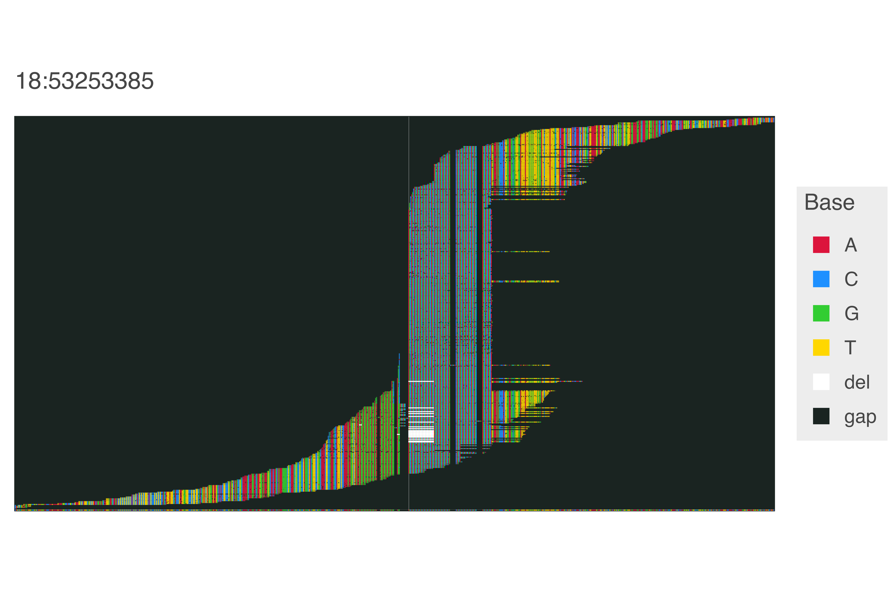

```html
<!DOCTYPE html>
<html>

<head>
    <title>jslfree080's github profile</title>
</head>

<body>
    <script src="js/transform-rotate-calculator.js"></script>
    <script src="js/date-parser.js" defer></script>
    <svg width="650" height="650">
        <circle r="290" cx="325" cy="325" fill="#006039" stroke="#a37e2c" stroke-width="25px"
            stroke-dasharray="30.3687289847">
            /*
            2*290*pi/60
            */
        </circle>
        <circle r="290" cx="325" cy="325" fill="#006039" stroke="#f4f4f2" stroke-width="25px"
            stroke-dasharray="30.3687289847" stroke-dashoffset="30.3687289847">
        </circle>
        <circle r="290" cx="325" cy="325" fill="#006039">
        </circle>
        <circle r="10" cx="325" cy="325" fill="#a37e2c"></circle>
        <style>
            .rolexWhite {
                font: italic 18px Garamond;
                fill: #f4f4f2;
                text-anchor: middle;
            }

            .rolexGold {
                font: bold 50px Garamond;
                fill: #a37e2c;
                text-anchor: middle;
            }
        </style>
        <text x="266.94306454910753" y="133.61193285355824" class="rolexWhite"
            transform="rotate(-16.875,266.94306454910753,133.61193285355824)">j</text>
        <text x="279.5847473931254" y="130.22460414453326" class="rolexWhite"
            transform="rotate(-13.125,279.5847473931254,130.22460414453326)">s</text>
        <text x="292.4209053210823" y="127.67133358302421" class="rolexWhite"
            transform="rotate(-9.375,292.4209053210823,127.67133358302421)">l</text>
        <text x="305.3965719340879" y="125.96305466556062" class="rolexWhite"
            transform="rotate(-5.625,305.3965719340879,125.96305466556062)">f</text>
        <text x="318.4561834356448" y="125.10708250472686" class="rolexWhite"
            transform="rotate(-1.875,318.4561834356448,125.10708250472686)">r</text>
        <text x="331.5438165643552" y="125.10708250472686" class="rolexWhite"
            transform="rotate(1.875,331.5438165643552,125.10708250472686)">e</text>
        <text x="344.6034280659121" y="125.96305466556062" class="rolexWhite"
            transform="rotate(5.625,344.6034280659121,125.96305466556062)">e</text>
        <text x="357.5790946789177" y="127.67133358302421" class="rolexWhite"
            transform="rotate(9.375,357.5790946789177,127.67133358302421)">0</text>
        <text x="370.4152526068746" y="130.22460414453326" class="rolexWhite"
            transform="rotate(13.125,370.4152526068746,130.22460414453326)">8</text>
        <text x="383.05693545089247" y="133.61193285355824" class="rolexWhite"
            transform="rotate(16.875,383.05693545089247,133.61193285355824)">0</text>

        <text x="325" y="85" class="rolexGold" transform="rotate(0,325,85)">XII</text>
        <text x="445" y="117.15390309173472" class="rolexGold" transform="rotate(30,445,117.15390309173472)">I</text>
        <text x="532.8460969082653" y="204.99999999999997" class="rolexGold"
            transform="rotate(60,532.8460969082653,204.99999999999997)">II</text>
        <text x="565" y="325" class="rolexGold" transform="rotate(90,565,325)">III</text>
        <text x="532.8460969082653" y="444.99999999999994" class="rolexGold"
            transform="rotate(120,532.8460969082653,444.99999999999994)">IV</text>
        <text x="445.0000000000001" y="532.8460969082653" class="rolexGold"
            transform="rotate(150,445.0000000000001,532.8460969082653)">V</text>
        <text x="325.00000000000006" y="565" class="rolexGold" transform="rotate(180,325.00000000000006,565)">VI</text>
        <text x="205.00000000000006" y="532.8460969082653" class="rolexGold"
            transform="rotate(210,205.00000000000006,532.8460969082653)">VII</text>
        <text x="117.15390309173478" y="445.0000000000001" class="rolexGold"
            transform="rotate(240,117.15390309173478,445.0000000000001)">VIII</text>
        <text x="85" y="325.00000000000006" class="rolexGold" transform="rotate(270,85,325.00000000000006)">IX</text>
        <text x="117.15390309173463" y="205.00000000000017" class="rolexGold"
            transform="rotate(300,117.15390309173463,205.00000000000017)">X</text>
        <text x="204.9999999999999" y="117.15390309173479" class="rolexGold"
            transform="rotate(330,204.9999999999999,117.15390309173479)">XI</text>

        /* the hour hand */
        <rect id="hour" x="319" y="280" class="rolexGold" transform="rotate(180 325 325)" width="12" height="200"
            rx="15"></rect>

        /* the minute hand */
        <rect id="minute" x="321" y="280" class="rolexGold" transform="rotate(180 325 325)" width="8" height="290"
            rx="15"></rect>

        /* the second hand */
        <rect id="second" x="323" y="280" class="rolexGold" transform="rotate(180 325 325)" width="4" height="330"
            rx="15"></rect>

        <circle r="3.5" cx="325" cy="325" fill="black"></circle>
    </svg>
    
</body>

</html>
```